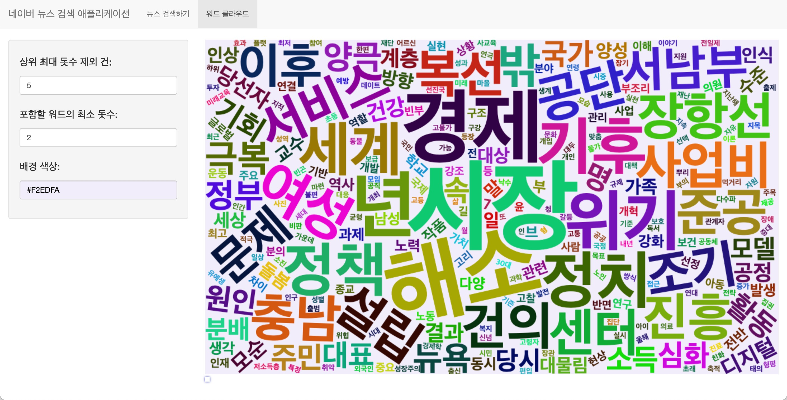
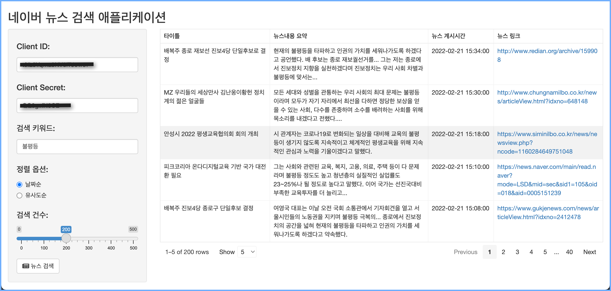
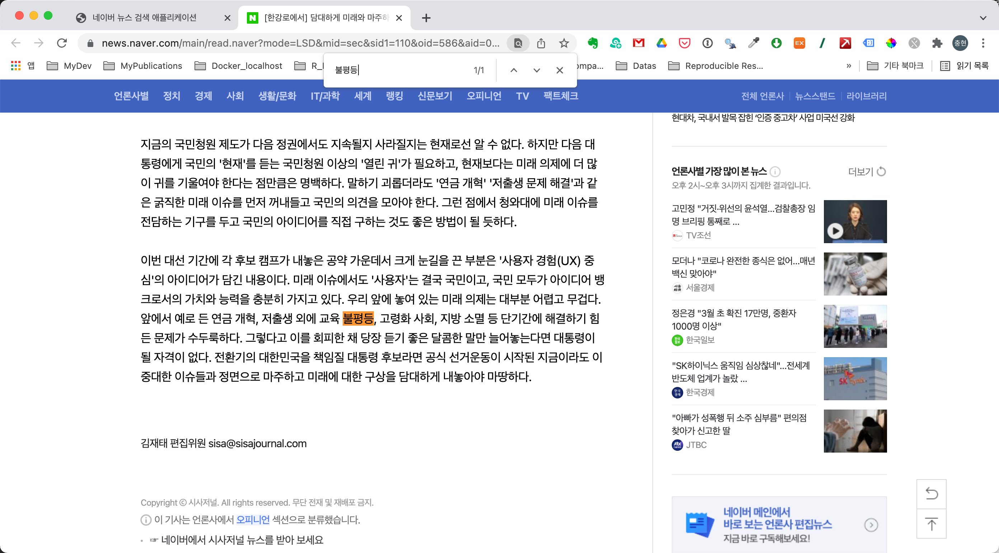

```{r setup, include=FALSE}
knitr::opts_chunk$set(echo = TRUE, 
                      message = FALSE, 
                      warning = FALSE, 
                      collapse = FALSE,
                      fig.align = "center")

library(shiny)
library(htmltools)
```

```{r news-app, echo=FALSE, out.width = "65%"}

```

```{r, preface, echo=FALSE}
div(class = "preface", 
    h3("들어가기"),
    "공격이 최선의 방어라는 격투기 격언이 있습니다. Shiny의 경우는", strong("실제로 애플리케이션을 개발해 보는 것이 최선의 학습"), "입니다.", br(),
    "간단하지만, 유용한 애플리케이션을 만들어 볼까요? 걱정할 필요 없습니다. 천천히 따라오세요",
    style = "margin-bottom: 40px;")
```

# 애플리케이션 설계
     
## 기능 설계

네이버 뉴스 검색 애플리케이션의 기능은 다음과 같이 정의합니다.

* 입력 기능
    - 사용자 인증을 위한 Client ID, Client Secret 입력
    - 검색하려는 뉴스 키워드 입력
    - 정렬 옵션 선택
        - 날짜순 정렬
        - 유사도순 정렬
    - 검색건수 입력    
* 출력 기능
    - 검색 뉴스 테이블 출력
        - 타이틀
        - 뉴스내용 요약
        - 뉴스 게시시간
        - 뉴스 링크
            - 하이퍼링크를 걸어서, 클릭하면 해당 브라우저 창을 열어 뉴스화면 이동 
* 시각화 출력 기능            
    - 입력기능
        - 상위 최대 돗수 제외 건
        - 포함할 워드의 최소 돗수
        - 플롯의 배경색
    - 검색 뉴스들 전체의 워드클라우드 출력

## 사용자 인터페이스 설계

* 페이지
    - navbarPage
* 레이아웃
    - sidebarLayout
* 패널
    - sidebarPanel
        - 입력 위젯 위치
    - mainPanel
        - 출력 위젯 위치    
* 입력 위젯
    - textInput
      - Client ID, Client Secret, 검색 키워드
    - radioButtons  
      - 정렬 옵션 선택
    - sliderInput
      - 검색건수
    - actionButton
      - 뉴스 검색 버튼
* 출력 위젯
    - reactable
        - 검색 결과 출력
* 시각화 입력 위젯
    - numericInput
      - 상위 최대 돗수 제외 건 선택
    - numericInput
      - 포함할 워드의 최소 돗수 선택    
    - colourInput
      - 배경색상 선택   
* 시각화 출력 위젯
    - wordcloud2Output
        - 검색 결과 출력
        
# 애플리케이션 코드

## UI Side

* ui.R

```{r, eval=FALSE}
navbarPage(
  "네이버 뉴스 검색 애플리케이션",
  tabPanel(
    "뉴스 검색하기",
    sidebarLayout(
      sidebarPanel(
        textInput("client_id", 
                  label = h4("Client ID:"), 
                  value = client_id),
        textInput("client_secret", 
                  label = h4("Client Secret:"), 
                  value = client_secret),            
        textInput("keyword", 
                  label = h4("검색 키워드:"), 
                  value = ""),
        radioButtons("sort", label = h4("정렬 옵션:"),
                     choices = list("날짜순" = "date", "유사도순" = "sim"), 
                     selected = "date"),           
        sliderInput("max_record", label = h4("검색 건수:"), min = 0,
                    max = 500, value = 100, step = 100),
        actionButton("search_keyword", label = "뉴스 검색", 
                     icon = icon("newspaper")),
        width = 3
      ),
      # Reactable에 검색 결과 리스트업
      mainPanel(
        reactableOutput("news_list"),
        width = 9
      )
    )
  ),
  
  tabPanel(
    "워드 클라우드",
    sidebarLayout(
      sidebarPanel(
        numericInput("remove_n", 
                     label = h4("상위 최대 돗수 제외 건:"), 
                     value = 5, min = 0
        ),
        numericInput("min_freq", 
                     label = h4("포함할 워드의 최소 돗수:"), 
                     value = 5, min = 1
        ),          
        colourInput("col_bg", 
                    label = h4("배경 색상:"), 
                    value = "white"),
        width = 3
      ),
      # 검색 결과 전체의 워드클라우드
      mainPanel(
        wordcloud2Output("cloud", height = "600px"),
        width = 9
      )
    ) 
  )
)
```

## Server Side

* server.R

```{r, eval=FALSE}
function(input, output, session) {
    newsList <- reactiveValues(
      list = data.frame(
        title = character(0),
        description = character(0),
        publish_date = character(0),
        link = character(0),
        stringsAsFactors = FALSE
      ) %>% 
        reactable(
          defaultColDef = colDef(
            align = "left"
          ),
          columns = list(
            title = colDef(
              name = "타이틀",
              width = 250,
            ),
            description = colDef(name = "뉴스내용 요약"),
            publish_date = colDef(
              name = "뉴스 계시시간",
              width = 150,
            ),
            link = colDef(
              name = "뉴스 링크",
              width = 250,
              html = TRUE,
              cell = function(url) {
                htmltools::tags$a(href = as.character(url), target = "_blank", as.character(url))
              }
            )    
          ),
          showPageSizeOptions = TRUE,
          pageSizeOptions = c(5, 10, 15), 
          defaultPageSize = 5,
          bordered = TRUE,
          highlight = TRUE
        )    
    )
    
    output$news_list <- renderReactable({
      newsList$list <-scraped_news() %>%
        mutate(title = title_text) %>%
        mutate(description = description_text) %>%
        mutate(publish_date = stringr::str_remove_all(publish_date,
                                                      "[[:alpha:]]")) %>%
        select(title, description, publish_date, link) %>% 
        reactable(
          defaultColDef = colDef(
            align = "left"
          ),
          columns = list(
            title = colDef(
              name = "타이틀",
              width = 250,
            ),
            description = colDef(name = "뉴스내용 요약"),
            publish_date = colDef(
              name = "뉴스 계시시간",
              width = 150,
            ),
            link = colDef(
              name = "뉴스 링크",
              width = 250,
              html = TRUE,
              cell = function(url) {
                htmltools::tags$a(href = as.character(url), target = "_blank", as.character(url))
              }
            )    
          ),
          showPageSizeOptions = TRUE,
          pageSizeOptions = c(5, 10, 15), 
          defaultPageSize = 5,
          bordered = TRUE,
          highlight = TRUE
        )
    })
    
    scraped_news <- eventReactive(input$search_keyword, {
      # 3개의 텍스트는 반드시 입력해야 함
      req(input$keyword)
      req(input$client_id)
      req(input$client_secret)
      
      write_api_key(input$client_id, input$client_secret)
      
      koscrap::search_naver(
        query = input$keyword,
        sort  = input$sort,
        chunk = min(input$max_record, 100),
        max_record = input$max_record,
        do_done = TRUE,
        client_id = input$client_id,
        client_secret = input$client_secret)
      })
  
  output$cloud <- renderWordcloud2({
    data <- scraped_news()
    
    create_wordcloud(
      data,
      remove_n = input$remove_n,
      min_freq = input$min_freq,
      background = input$col_bg
    )
  })
}
```

## Global Environments

* global.R

```{r, eval=FALSE}
# attach packages
library("shiny")
library("dplyr")
library("koscrap")
library("reactable")
library("htmltools")
library("tidytext")
library("wordcloud2")
library("colourpicker")

# Initialize global environments
write_api_key <- function(client_id = NULL, client_secret = NULL) {
  if (is.null(client_id)) {
    return()
  } else {
    client_info <- glue::glue("{client_id}:{client_secret}") %>%
      charToRaw() %>%
      base64enc::base64encode()

    write(client_info, file = ".api_key.info")
  }
}

get_api_key <- function(client_info) {
  client_info <- rawToChar(base64enc::base64decode(client_info)) %>%
    strsplit(":") %>%
    unlist()

  client_id <- client_info[1]
  client_secret <- client_info[2]

  list(client_id = client_id, client_secret = client_secret)
}

options(api.key.file = TRUE)

client_id <- ""
client_secret <- ""

if (getOption("api.key.file")) {
  if (grepl("scrap_app", getwd()) && file.exists(".api_key.info")) {
    client_info <- scan(file = ".api_key.info", what = "character")

    client_info <- get_api_key(client_info)
    
    client_id <- client_info$client_id
    client_secret <- client_info$client_secret    
  } else {
    options(api.key.file = FALSE)
  }
}

# create UDF
create_wordcloud <- function(data, remove_n = 5, min_freq = 5, background = "white") {
  data %>% 
    filter(nchar(description_text) > 0) %>%   
    unnest_tokens(noun, description_text, bitTA::morpho_mecab, type = "noun") %>% 
    group_by(noun) %>% 
    count() %>% 
    arrange(desc(n)) %>%     
    ungroup() %>%
    filter(n >= min_freq) %>% 
    filter(row_number() > remove_n) %>% 
    wordcloud2::wordcloud2(backgroundColor = background, 
                           fontFamily = "NamumSquare")
}
```

## 사용 패키지 및 애플리케이션 호출

```{r, eval=FALSE}
# Run the application 
shinyApp()
```

# 애플리케이션 실행

## 애플리케이션 실행 화면

애플리케이션을 실행하면 다음과 같의 화면을 얻을 수 있습니다.



## 뉴스링크 원문 조회하기

네번째 컬럼인 뉴스링크는 뉴스 원문의 URL 정보입니다. 이 URL을 클릭하면, 뉴스의 원문을 읽을 수 있습니다. 
다음은 특정 페이지의 뉴스를 링크를 클릭하여 열린 웹 페이지입니다. 네이버 뉴스 검색 애플리케이션에서 **불평등**이라는 키워드로 검색하였기 때문에, **불평등**이란 단어를 검색하였더니 1개 단어가 매칭되었습니다.



## 뉴스 요약 정보의 시각화

수집한 전체 뉴스 데이터 중에서 뉴스 요약을 집계합니다. 워드 클라우드를 그려 어떤 단어들이 발화되는지 살펴봅니다. 

다음은 워드클라우드 탭을 클릭하여 열린 웹 페이지입니다. **불평등**이라는 키워드로 검색된 기사들에서 어떤 단어들이 발화되는지 살펴봅니다.

