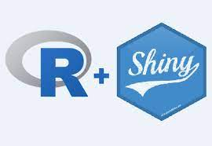
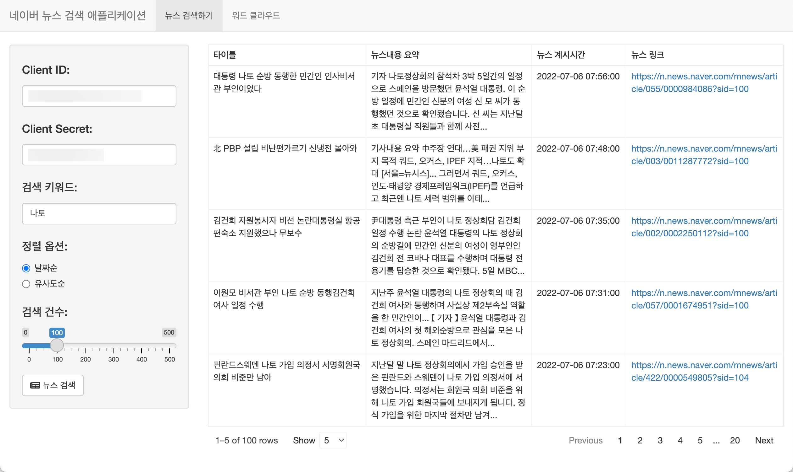
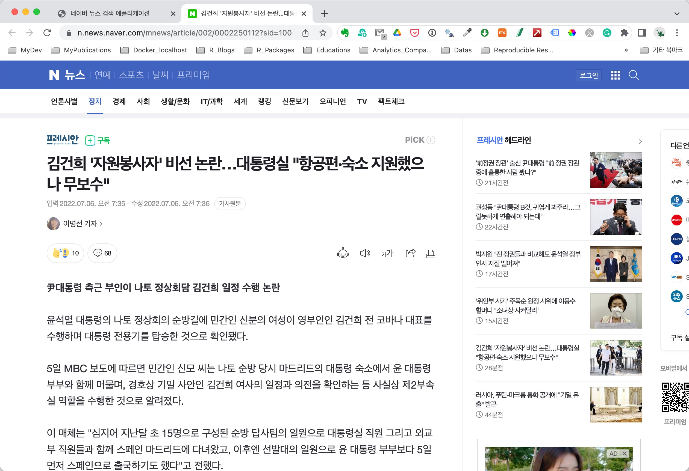
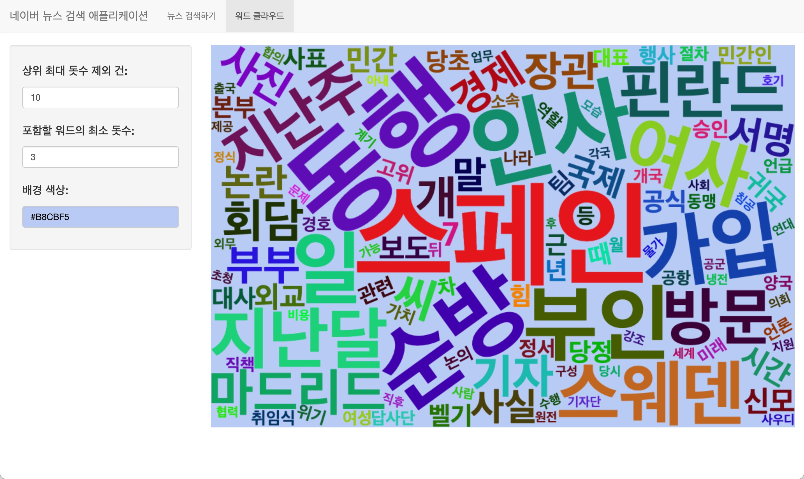

```{r child = "../setup.Rmd"}
```

```{r packages, echo=FALSE, message=FALSE, warning=FALSE}
library(tidyverse)
library(emo)
```

## 발표자와 자료 소개

<br>

.pull-left[
### .pink[유충현]
.pink[
- 현) 한화생명 Data Analytics팀
- 현) 한국R사용자회 대표
- 다수의 데이터 분석 프로젝트 수행 
- 데이터 분석 솔루션 개발
- 현) 분석가? 개발자? 정체성 혼란중
]
]
.pull-right[
### .light-blue[자료소개]
.light-blue[
- [데이터 수집기 개발](http://tidyverse-meets-shiny/docs/slide.html#:~:text=%EB%8D%B0%EC%9D%B4%ED%84%B0-,%EC%88%98%EC%A7%91%EA%B8%B0,-%EA%B0%9C%EB%B0%9C%20%E2%96%BE):
  - C로 배우는 통계학 (1994)
  - S-PLUS를 이용한 통계학 이해 (1997)
  - R 그래픽스 (2005)
  - R 프로그래밍 (2010)
  - R을 이용한 통계학의 이해 (2013)
  - R을 활용한 데이터 시각화 (2015) 
- R 패키지:
  - dlookr
  - alookr
]
]

---

## 미트업 FAQ

.pull-left-long-wide[
**Q - 발표 자료를 공유해 줄 수 있나요?**  

- **발표 자료**와 관련된 Shiny 앱 **소스**는 **모두 공개**합니다.
    - 발표자료: [https://choonghyunryu.github.io/tidyverse-meets-shiny](https://choonghyunryu.github.io/tidyverse-meets-shiny)
    - 앱 소스: [https://github.com/choonghyunryu/scrap_app](https://github.com/choonghyunryu/scrap_app)

**Q - 앱에서 사용한 한글 형태소분석기는 어떻게 설치하나요?**  
- Docker 이미지: 
    - [https://github.com/choonghyunryu/docker_rserver](https://github.com/choonghyunryu/docker_rserver)
        - RStudio Server, Shiny Server, Web Server, R Packages
        - 은전한닢 형태소분석기, RMecab
        - Google Chrome for pagedown package
]

---

class: middle

# Shiny 애플리케이션이란 무엇일까?

---

class: middle

# .hand[We...]

.huge[.green[have]] .hand[데이터 파일, 혹은 DBMS의 테이블 데이터]

.huge[.pink[want]] .hand[웹 어플리케이션 안에서 데이터 분석 기능의 구현]

---

## 바늘과 실, 그리고 R과 Shiny

.pull-left[
```{r echo=FALSE, out.width="50%"}

```
- **R을 사용 웹 애플리케이션 프레임워크**
- 오픈소스 R 패키지 및 서버
- HTML, CSS, JS 지식 없이 앱 개발
]
.pull-right[
```{r echo=FALSE, out.width="70%"}
knitr::include_graphics("img/bitstat_kor.jpeg")
```
- BitStat 오픈통계 패키지 개발 중
- **기업 내 데이터분석 앱 활용**
- https://shiny.rstudio.com/gallery/
]

---

## 분석이라 쓰고 개발이라 읽습니다!!!

.small[
```{r eval=FALSE, echo=FALSE}
library(dplyr)

method <- c("Statistics", "Machine Learning", "Deep Learning", "Text Mining")
app <- c("통계적 추론", "이진 분류", "이미지, 텍스트의 인식", "텍스트 의미 파악")
task <- c(
  "가설정의 > 모델링", 
  "변수선택 및 파생 >> 모델적합", 
  "라벨링 >> 모델적합", 
  "데이터 정제 > NLP >> 모델적합"
)
postion <- c("적음", "중간", "적음", "많음")

data.frame(method, app, task, postion) %>% 
  rename("분석 방법론" = method) %>% 
  rename("주된 활용 분야" = app) %>% 
  rename("분석의 중요 태스크" = task) %>% 
  rename("데이터 조작 작업 비중" = postion) %>%   
  kableExtra::kbl(booktabs = TRUE) %>% 
  kableExtra::kable_styling()
```
]

.tip[
하루 종일 **텍스트를 탐색하며, 정제하고 분석의 실마리를 위한 패턴을 찾고**...<br>
오늘도 그리고 내일도 또...<br>
분석의 수율을 높이기 위해서 대충할 수 없는, 아 **텍스트 전처리 작업**. 
]

```{r echo=FALSE, out.width="95%"}

```

---

class: middle

# 앱 개발을 위한 시나리오

---

## 분석 주제 선정의 배경

.tip[
데이터 **분석 주제를 선정하는 것부터 데이터 분석이 시작**됩니다.
]

.large[.orange[네이버 뉴스 검색하기 주제 선정 이유]]

* API 기반의 데이터 수집의 이해
    - 뉴스 데이터 수집의 흥미 유발
    - 최근 사회적 이슈는 무엇인가?
    
* 텍스트 데이터의 핸들링 이해
    - 가벼운 형태소 분석
        - Mecab 형태소분석기 소개
    - 가벼운 텍스트 데이터 시각화

---

## 첫번 째 시나리오

.tip[
**네이버 뉴스를 수집**합니다.
]

* .orange[무엇으로 뉴스를 수집할까?]
    - [koscrap 패키지](https://github.com/choonghyunryu/koscrap)
    - 아파트실거래, NAVER의 뉴스검색 데이터를 수집
    - toy 패키지
    
* .orange[개인의 API 키는 비밀유지가 필수라는데?]
    - 앱 소스에 API 키 정보 미 기입
      - 앱 화면에서 입력
    - **사용자 입력정보의 파일 저장**
      - 재구동 시 입력안해도 됨
      - **base64 인코딩** 저장
      
---

## 두번 째 시나리오

.tip[
**기사의 내용을 어떻게 파악할까요?**
]

* .orange[어떻게 기사를 읽을까?]
    - 뉴스 **내용 요약을 출력**해서 대략의 맥락 파악하기
    - **뉴스 링크**를 눌러 원문 읽기 
      - 네이버 뉴스 섹션 링크
      - 개별 신문사 페이지 링크
    - 날짜순/유사도순 정렬 선택, 검색건수 선택  
    
* .orange[어떤 단어들이 발화되는가?]
    - 수집된 **전체 뉴스**의  **내용 요약**을 대상으로
    - 워드클라우드 플로팅
      - 상위 최대 돗수 단어 제외하기
      - 포함할 최소 돗수 선택하기
      
---

class: middle

# 주요 기능 소개

---

## 뉴스 검색 기능

.tip[ 
**API 키/패스워드 입력**후, **검색어**를 입력합니다. **정렬옵션**과 **검색 건수**는 **선택사항**입니다.
]

```{r echo=FALSE, out.width="65%"}

```

---

## 기사 읽기 기능

.tip[ 
**목록의 뉴스 링크**를 클릭하여 개별 뉴스를 읽을 수 있습니다.
]

```{r echo=FALSE, out.width="55%"}

```

---

## 시각화 기능

.tip[ 
**워드클라우드**를 조회합니다. 몇개의 파라미터를 지원합니다.
]

```{r echo=FALSE, out.width="65%"}

```

---

class: middle

# Shiny 앱 개발이란 이런 것이다!

---

class: middle

# .hand[We...]

.huge[.green[have]] .hand[텍스트 데이터와 관련 정형데이터]

.huge[.pink[want]] .hand[텍스트에 내포된 화자의 의도 패턴을 활용 목적에 맞게 이해]

---

class: middle

# Q & A
